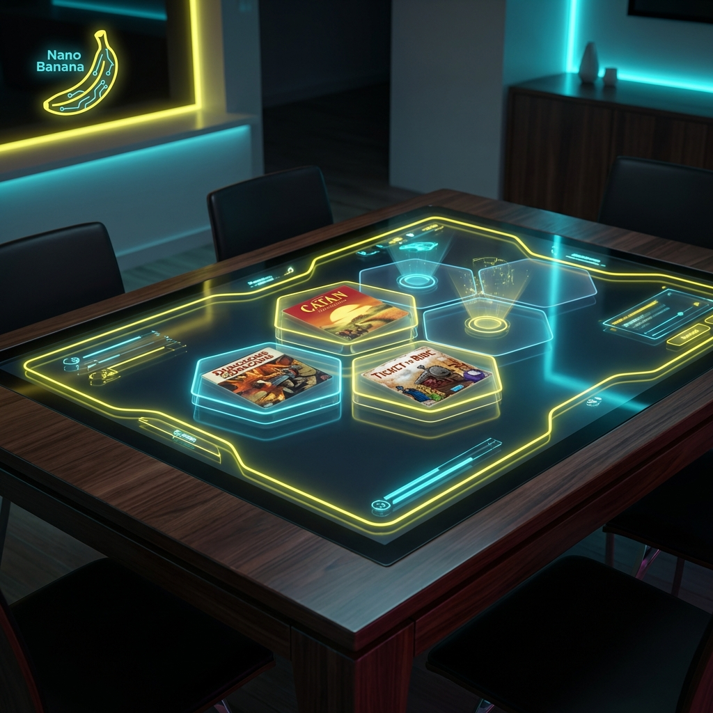
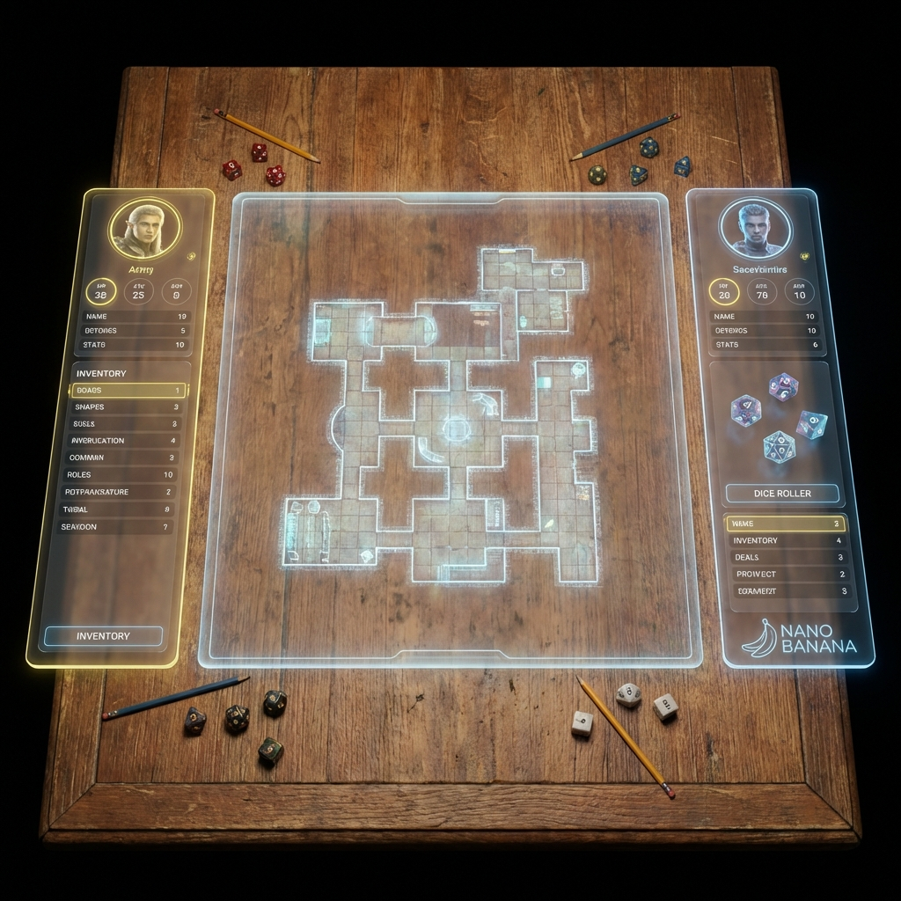

# Slick Tabletop Launcher UI: Nano Banana Edition

## Overview
This proposal outlines the UX/UI for a ground-breaking tabletop game launcher designed for a full-size touch-screen dining table. The "Nano Banana" design language emphasizes fluidity, organic curves, and high-contrast neon accents against deep matte backgrounds, bridging the physical and digital gaming worlds.

## Core Philosophy: The Nano Banana Aesthetic
- **Slick & Organic**: No sharp corners. Everything is rounded, fluid, and touch-first.
- **Dark Mode Native**: To reduce glare in a dining setting, the interface uses deep blacks (#050505) and charcoal grays.
- **Neon Accents**: Key interactive elements glow with "Banana Yellow" (#FFE135) and "Nano Cyan" (#00FFCC).
- **Physical-Digital Hybrid**: The UI acknowledges physical objects (dice, minis) placed on the table, flowing around them.

## Screen 1: The Launcher (Home)
The default state when the table is active but no game is running.

### Visual Concept

*Concept: Hexagonal grid layout with floating glass tiles. The background is a subtle, animating nebula.*

### User Interactions
1.  **Orbit Navigation**:
    -   **Concept**: Game icons are not in a list, but in a solar-system-like orbit around a central "Active Hub".
    -   **Gesture**: Swipe in a circular motion to rotate the orbit. The faster you swipe, the faster it spins (with friction).
    -   **Tap**: Tapping a game planet pulls it into the center, expanding it to show "Play", "Settings", and "Resume".

2.  **Multi-User Docket**:
    -   **Concept**: Each physical seat at the table has a private, retractable "dock" at the edge of the screen for personal settings (volume, accessibility, notification privacy).
    -   **Gesture**: Swipe up from the table edge to reveal. Swipe down to dismiss.
    -   **Orientation**: Text and icons automatically rotate to face the user at that edge.

## Screen 2: Game Session Overlay
When playing a game (e.g., D&D, Catan Digital), the UI shifts to a support role.

### Visual Concept

*Concept: Non-intrusive HUD elements. A shared central map area. Player zones at each seat.*

### Features
1.  **Smart Zones**:
    -   The layout automatically orients UI elements (health bars, card hands, resource counters) to face the player sitting at that specific edge.
    -   **Interaction**: "Flick" a card from your zone to the center to play it. It grows in size and rotates to face the current active player.

2.  **The "Banana Split" Menu**:
    -   A gesture-based radial menu that can be summoned anywhere on the playing surface.
    -   **Gesture**: Three-finger tap reveals the menu (Settings, Pause, Dice Roller, Wiki).
    -   **Selection**: Slide finger to the desired sector and release.

## Screen 3: The Nano Banana Concept Tools
Using our proprietary "Nano Banana" engine (conceptually), users can generate assets on the fly.

### Visual Concept
*Concept: A user sketches a rough shape, and the AI resolves it into a 3D prop.*

### Interactions
-   **Sketch-to-Spawn**: Draw a rough shape (e.g., a sword) on the table with a finger; it resolves into a high-fidelity 3D item card.
-   **Voice Command**: "Nano, drop a dragon here." (Visualizes a dragon token on the map).
-   **Token Scanning**: Place a physical miniature on the screen. The table scans its base footprint and creates a digital aura around it, tracking its movement.

## Technical Requirements
-   **Hardware**: 55"+ Capacitive Touch Surface, 4K resolution, 120Hz refresh rate.
-   **Software**: Web-based wrapper (Electron/Tauri) running a SvelteKit frontend (LauncherUI).
-   **Input**: Multi-touch (up to 40 simultaneous touch points) + Voice recognition.

## Next Steps
1.  Prototyping the "Orbit Navigation" in CSS/JS using CSS 3D transforms.
2.  Building the basic `Layout.svelte` with edge-detection logic for the "Smart Zones".
3.  Defining the "Banana Theme" CSS variables in `src/app.css` (e.g., `--color-nano-yellow`, `--glass-blur-strength`).
