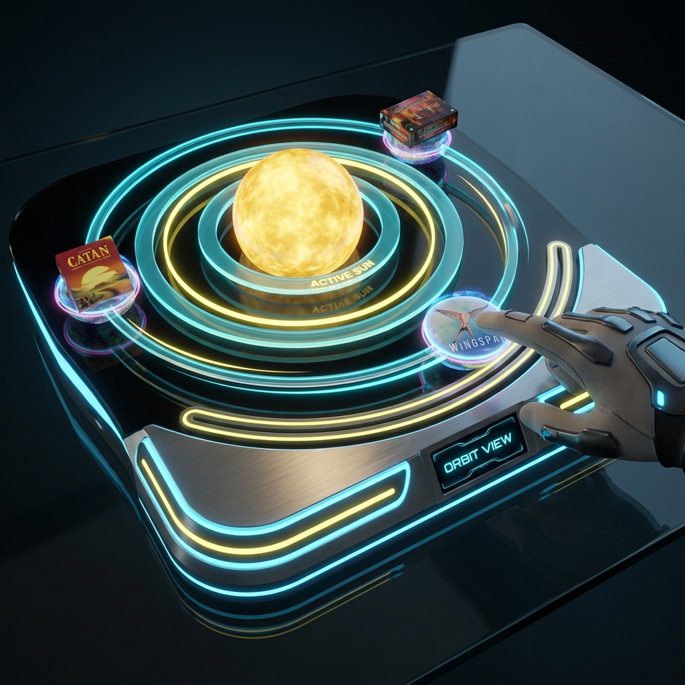
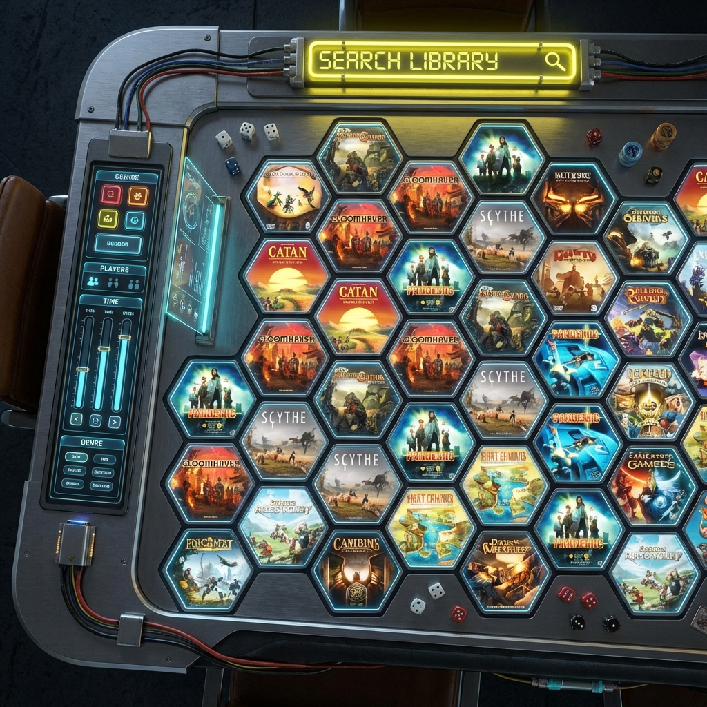
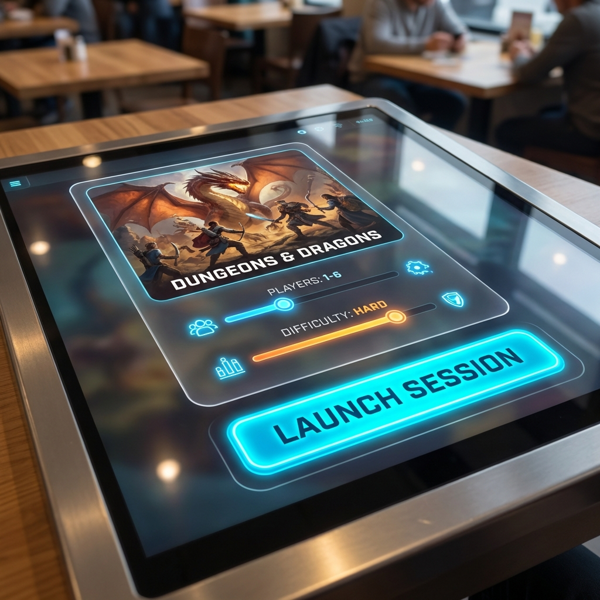

# Slick Tabletop Launcher UI: Nano Banana Edition

## Overview
This proposal outlines the UX/UI for the "Launcher" component of a tabletop game system. The focus is strictly on the **Game Selection** and **Game Initiation** flows. The design language, "Nano Banana," emphasizes high-contrast neon aesthetics, fluid orbital mechanics, and tactile touch interactions suitable for a dining room table context.

## Core Philosophy: The Nano Banana Aesthetic
- **Tactile Physics**: Digital objects have weight and inertia. Swiping feels like spinning a physical wheel.
- **Dark Mode Native**: Deep blacks (#050505) with "Banana Yellow" (#FFE135) and "Nano Cyan" (#00FFCC) accents.
- **Social Orientation**: The UI creates a centerpiece for the gathering, rotating to welcome users from any seat.

---

## 1. The Orbit View (Default)
The idle state of the table, designed to be visually arresting but not overwhelming.

### Visual Concept

*Concept: Games "orbit" a central sun. The active category (e.g., "Strategy") is the sun.*

### Interactions
1.  **Orbital Spin**:
    -   Users can swipe anywhere on the glass to spin the solar system.
    -   **Friction**: The spin has inertia, slowing down gradually.
    -   **Gravitational Pull**: Tapping a "planet" (game) pulls it into the center, transitioning to the **Pre-Launch** view.

2.  **Solar Shift (Category Selection)**:
    -   **Trigger**: A "Pinch-Out" gesture starting from the Central Sun.
    -   **Transition**: The camera zooms out to "Galaxy View", where the Sun dissolves into a cluster of stars (the current category). Other star clusters (Categories: "Strategy", "Party", "Wargame") drift into view.
    -   **Selection**: Tapping a destination cluster zooms the camera into it. That cluster condenses to form the new Active Sun, and its games spawn as planets in orbit.

---

## 2. The Grid View (Browse)
For power users or when searching for a specific title in a large library.

### Visual Concept

*Concept: A "Honeycomb" grid maximizing screen real estate while maintaining the hexagonal aesthetic.*

### Interaction: Invoking & Orientation
1.  **Transition to Search**:
    -   **Trigger**: A "Search Satellite" orbits the sun at a fixed distance. Tapping this satellite triggers the Search View.
    -   **Orientation Detection**: The table detects the "angle of attack" of the tap.
        -   The center of the table is $(0,0)$.
        -   The tap coordinate $(x,y)$ creates a vector.
        -   The UI rotates $RotZ = atan2(y, x) - 90\deg$ so the bottom of the search interface faces the user who tapped.
    -   **Animation**: The Search Satellite expands and unfolds into the Honeycomb Grid, originating from the user's side of the table.

2.  **Dismissal & Return**:
    -   **Fade Out**: If no interaction occurs for **30 seconds**, the grid dissolves back into the Orbit View to reduce visual clutter.
    -   **Manual Close**: A drag-down gesture on the search header ("stowing" the keyboard) collapses the grid back into the Search Satellite.
    -   **Success**: Tapping a game tile transitions immediately to the **Game Pre-Launch** view (which also orients to the active user).

### Features
1.  **Smart Filters**:
    -   **Edge Filters**: Sliders on the table edge allow multiple users to filter simultaneously (e.g., "Player Count: 4", "Time: < 60m").
    -   The grid dynamically reshuffles to bubble up matching games to the center.

---

## 3. Game Pre-Launch
The final step before the game begins. This is a modal-like state that takes over the screen.

### Visual Concept

*Concept: A rich, immersive "Box Back" experience. High-fidelity art, setup options, and a clear call to action.*

### UI Elements
1.  **Session Config**:
    -   **Player Slider**: A neon slider to set the number of players.
    -   **Difficulty Toggle**: Simple toggle for Standard/Hardcore modes.
    
2.  **The Launch Button**:
    -   A massive, pulsing "LAUNCH SESSION" button.
    -   **Interaction**: Requires a "Long Press" (1.5s) to activate, filling up with light, to prevent accidental starts.
    -   **Transition**: Upon release, the button explodes into particles that form the loading screen for the game engine.

## Navigation Flow
1.  **Idle**: Orbit View.
2.  **Search**: Tap "Grid" icon -> Grid View.
3.  **Select**: Tap a Planet (Orbit) or Hex (Grid) -> Pre-Launch View.
4.  **Confirm**: Long-press "Launch" -> Game Starts.
