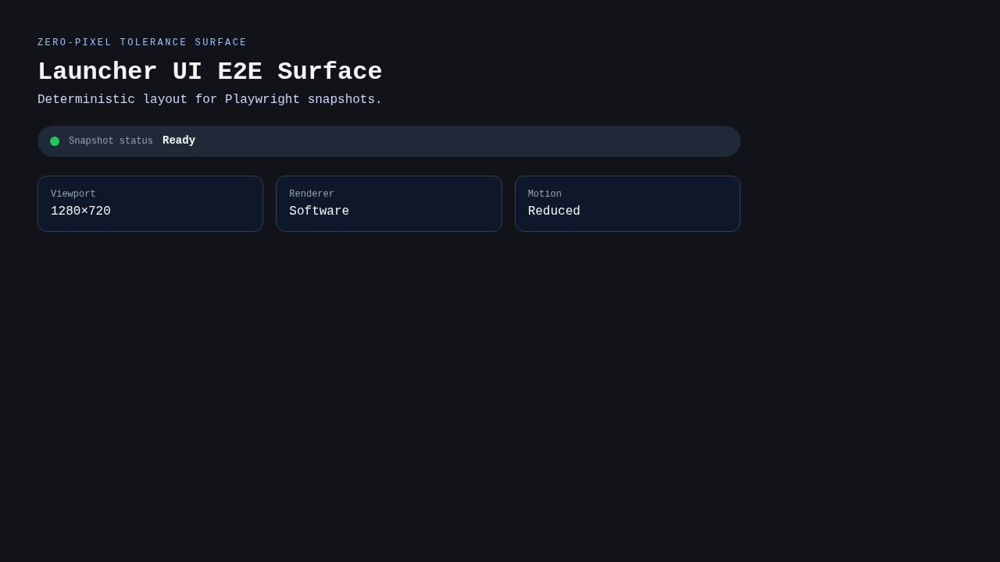

# Test: Launcher UI E2E Surface

**As a** developer, **I want** a deterministic launcher surface, **so that** pixel diffs are meaningful.

## E2E surface renders deterministic content

**Verifications:**
- [x] Surface header is visible
- [x] Status badge reads Ready

---
