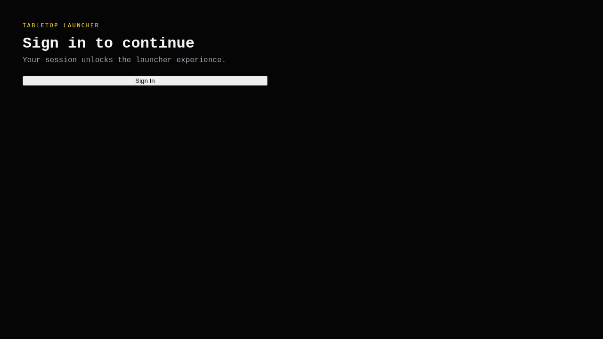

# Test: Sign-in gating

**As a** player, **I want** sign-in required before the launcher, **so that** sessions stay scoped.

## Sign-in is available when auth is required

**Verifications:**
- [x] Sign-in heading is visible

---

## Launcher routes to sign-in when auth is required

**Verifications:**
- [x] URL ends with /signin
- [x] Sign-in screen is rendered

---

