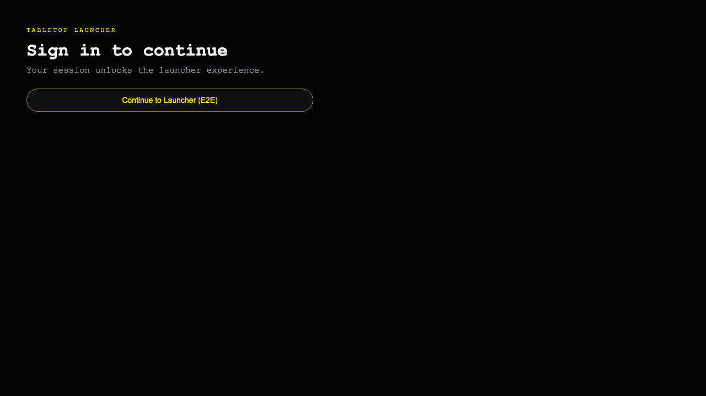
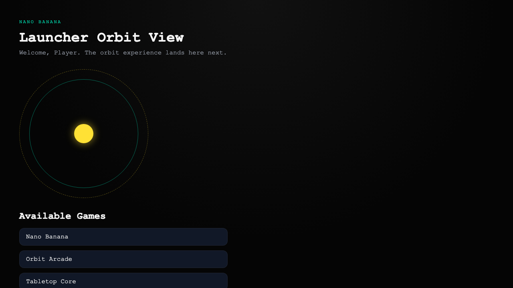

# Test: E2E sign-in flow

**As a** player, **I want** to sign in and land on the launcher, **so that** I can start a session.

## Sign-in screen is ready

**Verifications:**
- [x] Emulator sign-in button is visible

---

## Launcher loads after sign-in

**Verifications:**
- [x] URL ends with /launcher
- [x] Launcher heading is visible
- [x] Games section is present
- [x] Games list is populated

---

